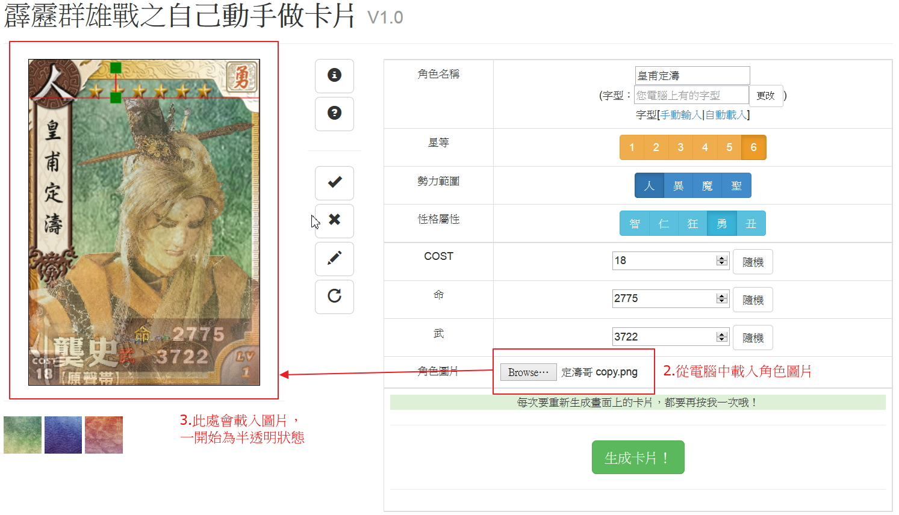
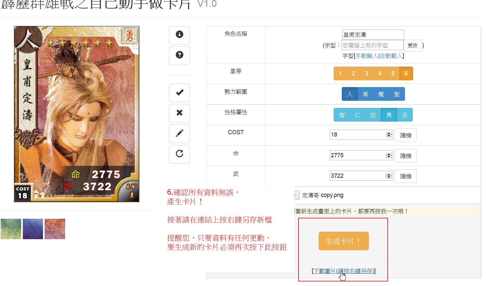

# 霹靂群雄戰之自己動手做卡片

##馬上使用「霹靂群雄戰之自己動手做卡片」！
[GitHub.io](http://jeanycyang.github.io/PiliCardMaker/)

***

## 語言
由JavaScript撰寫，完全由前端處理，無須後端程式。
## 版權
這是一個為智樂堂公司經霹靂公司授權開發的遊戲，「霹靂群雄戰」，開發的趣味小程式。
MIT License.

***

##使用說明書
1. STEP ONE

2. STEP TWO

3. STEP THREE

4. STEP FOUR

5. STEP FIVE

